# PES-VCS Lab Report

## Student Details
- Name: Ashmita Chaki
- SRN: PES2UG24CS090
- GitHub Repository: https://github.com/ashyune/OS-U4-Orange

## Environment
- OS: Linux
- Compiler: gcc
- Libraries: OpenSSL (`libssl-dev`)

## Implemented Files
- `object.c`: `object_write`, `object_read`
- `tree.c`: `tree_from_index`
- `index.c`: `index_load`, `index_save`, `index_add`
- `commit.c`: `commit_create`

## Build and Test Commands Used
```bash
make clean
make all
make test_objects
make test_tree
make test-integration
```

## Screenshot Evidence

### 1A — `./test_objects` output showing all tests passing
```bash
make test_objects
./test_objects
```
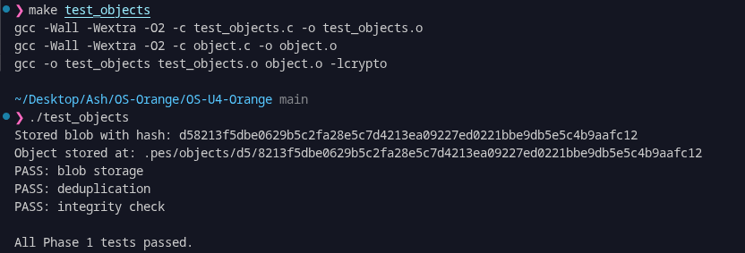
### 1B — `find .pes/objects -type f` showing sharded structure
```bash
find .pes/objects -type f
```
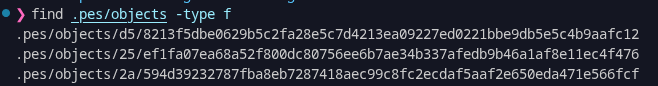

### 2A — `./test_tree` output showing all tests passing
```bash
make test_tree
./test_tree
```
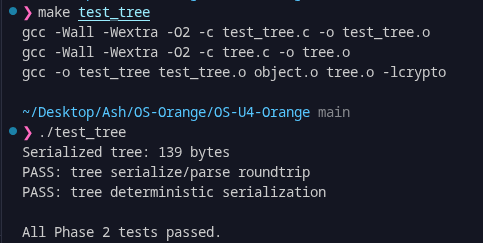

### 2B — `xxd` of a raw tree object (first 20 lines)
```bash
TREE_OBJ=$(find .pes/objects -type f | head -n 1)
echo "$TREE_OBJ"
xxd "$TREE_OBJ" | head -20
```
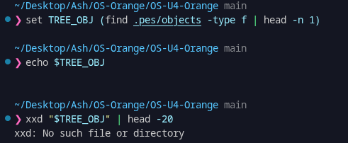

### 3A — `pes init` -> `pes add` -> `pes status`
```bash
make pes
./pes init
echo "hello" > file1.txt
echo "world" > file2.txt
./pes add file1.txt file2.txt
./pes status
```
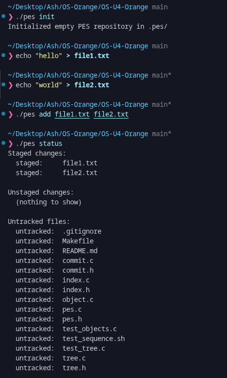

### 3B — `cat .pes/index` (text format index)
```bash
cat .pes/index
```
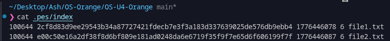

### 4A — `pes log` output with three commits
```bash
./pes init
echo "Hello" > hello.txt
./pes add hello.txt
./pes commit -m "Initial commit"

echo "World" >> hello.txt
./pes add hello.txt
./pes commit -m "Add world"

echo "Goodbye" > bye.txt
./pes add bye.txt
./pes commit -m "Add farewell"

./pes log
```
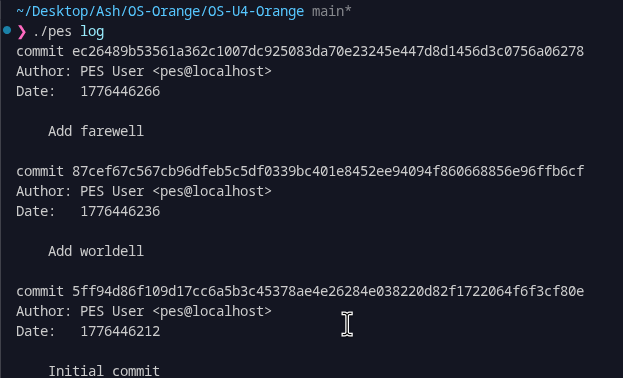

### 4B — `find .pes -type f | sort` showing object growth
```bash
find .pes -type f | sort
```
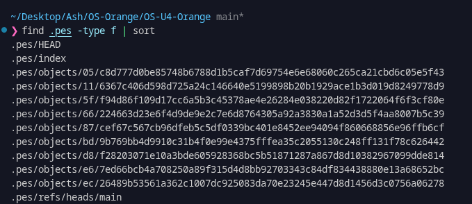

### 4C — `cat .pes/refs/heads/main` and `cat .pes/HEAD`
```bash
cat .pes/refs/heads/main
cat .pes/HEAD
```
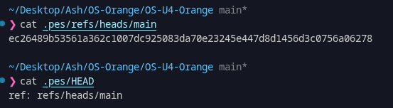

### Final — Full integration test
```bash
make test-integration
```
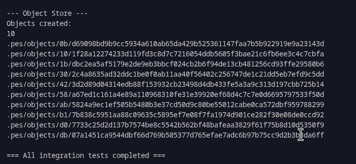
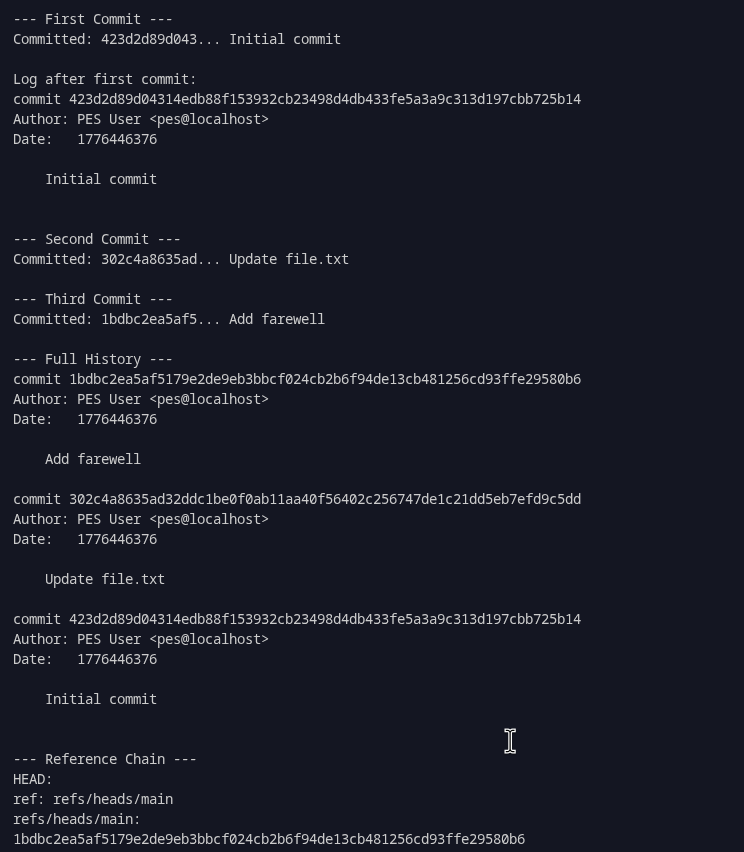
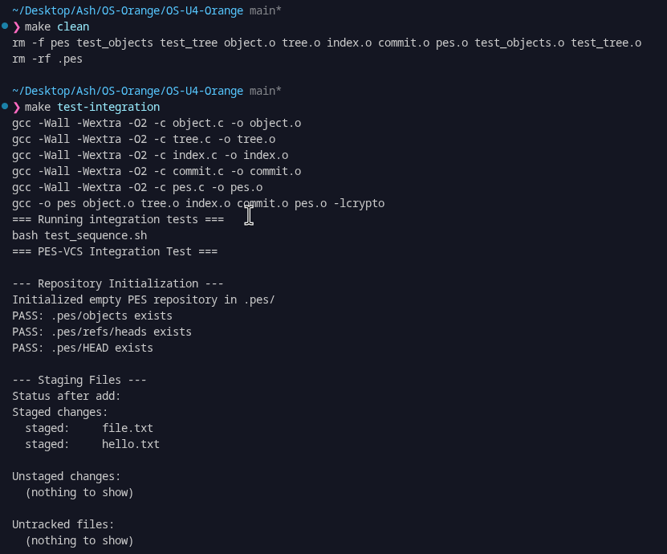

## Phase 5 & 6, Analysis Questions

### Q5.1: Checkout implementation & complexity
Checkout updates both metadata and working directory.

Metadata:
- Resolve branch -> commit hash (from refs)
- Update HEAD to point to branch
- Update index to match commit tree

Working directory:
- Read commit -> tree -> recreate files/folders
- Remove files not in target branch
- Restore file permissions

Why complex:
- Must avoid overwriting uncommitted changes
- Handle file <-> directory conflicts
- Apply deletions/renames safely
- Keep HEAD, index, and working tree consistent (atomicity)

### Q5.2: Detect dirty working directory
Compare per file:
1. HEAD vs Index -> staged changes
2. Index vs Working dir -> unstaged changes
3. HEAD vs Target branch -> what checkout will change

Conflict condition:
- File is locally modified (dirty) and
- Target branch also changes it
-> Refuse checkout to avoid data loss.

### Q5.3: Detached HEAD
- HEAD points directly to a commit (not a branch)
- New commits are created but not attached to any branch
- These commits can be lost

Recovery:
- Create a branch at that commit hash
- Continue work from there
- (Git uses reflog; simple VCS requires manual tracking)

### Q6.1: Finding unreachable objects
Use mark-and-sweep GC:

Mark:
- Start from all branch tips (+ HEAD)
- Traverse commits -> trees -> blobs
- Store reachable hashes in a hash set (O(1) lookup)

Sweep:
- Delete objects not in reachable set

Estimate:
- ~100,000 commits (not 50×100k due to shared history)
- Total objects: hundreds of thousands to a few million

### Q6.2: GC vs commit race condition
Problem:
- Commit writes objects (blobs/trees) first
- Before updating branch ref, objects are "unreachable"
- GC may delete them
- Final commit points to missing objects -> corruption

How Git avoids this:
- Uses locking for refs
- Delays deletion (keeps recent unreachable objects)
- Uses reflogs and safe pruning rules

## Submission Checklist
- Added all required screenshots.
- Added answers for Q5.1, Q5.2, Q5.3, Q6.1, Q6.2.
- Implemented required code in `object.c`, `tree.c`, `index.c`, `commit.c`.
- Maintained minimum 5 commits per phase and pushed to GitHub.
- Repository is public.
